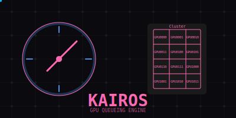

# [Kairos](https://en.wikipedia.org/wiki/Kairos): GPU Job Scheduler




A Python package for scheduling and running multiple jobs across a local GPU cluster.

Think of it as a local, single-user equivalent to SLURM.

The scheduler monitors GPU memory usage and automatically manages job distribution to make efficient use of GPU resources.


## Roadmap

I'd like to implemenet a more rigorous version of this in Rust at some point in future, possibly with a persistent queue on disk.

## Features

- 🎮 Support for multiple GPUs with configurable jobs per GPU
- 📊 GPU memory limits with configurable thresholds
- 🔄 Automatic job queuing and distribution
- 🐍 Virtual environment support
- 🌍 Custom envfironment variables per job
- 📝 Structured logging with rotation and configurable levels
- 🧪 Comprehensive test suite with GPU and CPU (mock) tests
- 🚀 Easy to integrate into existing projects

## Installation

1. Clone the repository:
```bash
git clone https://github.com/b-d-e/kairos.git
cd kairos
```

2. Verify you have CUDA drivers installed and accessible (tested on CUDA v12):
```bash
nvidia-smi
```

3. Create and activate a virtual environment (recommended):
```bash
python -m venv .venv
source .venv/bin/activate  # Unix/macOS
# or
.venv\Scripts\activate     # Windows
```

4. Install the package:
```bash
# For basic installation
pip install .

# For development (includes testing tools)
pip install -e ".[dev]"
```

## Quick Start

```python
from kairos import GPUScheduler, Job

# Initialise scheduler with 4 GPUs, 2 jobs per GPU
scheduler = GPUScheduler(n_gpus=4, jobs_per_gpu=2)

# Define your jobs - in pracitce, probably dynamically
jobs = [
    Job(
        command="python train.py --config config1.yaml",
        venv_path=".venv",
        working_dir="/path/to/project",
        job_name="train_model1"  # Optional name for better log identification
    ),
    Job(
        command="python train.py --config config2.yaml",
        env={"PYTORCH_CUDA_ALLOC_CONF": "max_split_size_mb:5000"},
        job_name="train_model2"
    )
]

# Run all jobs
results = scheduler.run_jobs(jobs)
```

## Package Structure

```
kairos/
├── src/
│   └── kairos/
│       ├── __init__.py
│       ├── models.py        # Data models (Job, GPUSlot)
│       ├── logging.py       # Logging functionality
│       ├── scheduler.py     # Main scheduler implementation
│       └── gpu.py       # GPU utilities
├── tests/
│   ├── __init__.py
│   ├── conftest.py         # Test fixtures
│   ├── test_scheduler_cpu.py
│   └── test_scheduler_gpu.py
└── pyproject.toml          # Package configuration
```

## Development

### Setting up the development environment

```bash
# Clone the repository
git clone https://github.com/b-d-e/kairos.git
cd kairos

# Create and activate virtual environment
python -m venv .venv
source .venv/bin/activate  # Unix/macOS
# or
.venv\Scripts\activate     # Windows

# Install development dependencies
pip install -e ".[dev]"

# Install pre-commit hooks
pre-commit install
```

### Running Tests

```bash
# Run CPU-only tests
pytest -v -m "cpu"

# Run GPU tests (requires CUDA)
pytest -v -m "gpu"

# Run all tests with coverage
pytest -v --cov=kairos
```

## Detailed Usage

### Job Configuration

Each job can be configured with:
```python
Job(
    command="your_command",           # Required: Command to run
    env={"KEY": "VALUE"},            # Optional: Additional environment variables
    venv_path="/path/to/venv",       # Optional: Virtual environment path
    working_dir="/path/to/workdir",  # Optional: Working directory for the job
    job_name="my_job"                # Optional: Name for log identification
)
```

### Scheduler Configuration

```python
scheduler = GPUScheduler(
    n_gpus=4,                # Number of GPUs available
    jobs_per_gpu=2,          # Jobs per GPU
    memory_threshold=50.0,   # Wait until GPU memory is below this percentage
    check_interval=5.0,      # Seconds between memory checks
    log_dir="logs"           # Directory for log files
)
```

## Logging

The scheduler now uses a structured logging system with:
- Rotating log files with size limits
- Separate log files for each job
- JSON-formatted metadata
- Configurable log levels

Log files are organized as:
- `logs/kairos.log` - Main scheduler log (with rotation)
- `logs/<job_name>_<timestamp>.log` - Individual job logs

## Memory Management

The scheduler monitors GPU memory usage and only starts new jobs when:
1. A GPU slot is available
2. The GPU's memory usage is below the specified threshold

Memory monitoring features:
- Configurable memory threshold (default: 50%)
- Configurable check interval (default: 5 seconds)
- Proper error handling for GPU queries
- Detailed memory usage logging

## Requirements

- Python 3.9+
- NVIDIA GPUs with CUDA drivers
- `nvidia-smi` available in PATH

## License

This project is licensed under the MIT License - see the LICENSE file for details.
